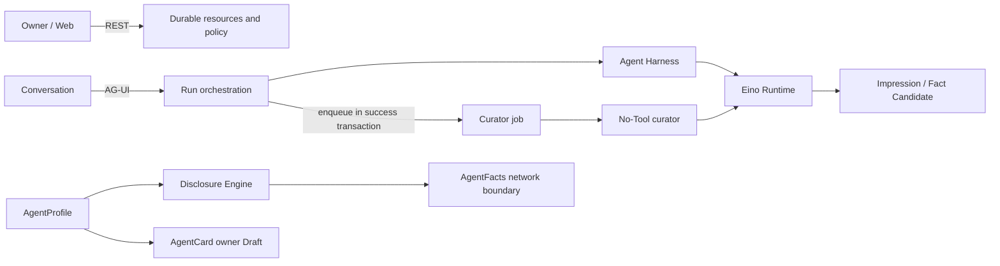

# Architecture overview

AegisLink is a Go modular monolith with a React Web client. Its Personal Agent OS deployable units are one API server, one Web client, and one PostgreSQL database. The repository also contains an independently runnable Agent Index with its own PostgreSQL-backed AgentAddr Registry. This first-hop navigation slice does not yet make the product a working multi-Agent network.

```text
React 19 + Vite
  ├── REST through generated OpenAPI types
  └── AG-UI for active Runs
            │
Gin (internal/httpapi)
            │
Domain services / Conversation orchestrator / Agent Harness
            │
  ┌─────────┴──────────┐
PostgreSQL adapter   Domain-neutral Runtime
(GORM + Goose)       (Eino + model providers)

Agent Server --future routing projection--> aegislink-index
                                                └── AgentAddr Registry today
```

## Four isolated primary paths



- **Owner/control path:** REST manages Account, Agent, Profile, Memory, Skill, MCP, Publication, and history resources.
- **Execution path:** AG-UI carries only active Runs. `conversation` reloads the authoritative Agent and history; Harness resolves context and authorized capabilities before invoking Runtime.
- **Cognitive maintenance path:** only a successful Run creates a durable curator job. The worker asynchronously maintains fallible Impressions and reviewable Fact Candidates.
- **Publication path:** the Disclosure Engine builds AgentFacts from the private Profile. AgentCard remains owner-preview only until a real A2A interface exists.

The paths share Principal/Agent ownership and PostgreSQL transactions, but not transport types or trust levels. AG-UI input cannot authorize a Tool, curator output cannot directly become a Confirmed Fact, and Profile content cannot bypass Disclosure Policy to reach the network.

The standalone Index is outside these four Agent Server paths. It must consume only future disclosure-approved routing projections and must never connect to the Agent Server database. The detailed boundary and MVP algorithm are in [Distributed Agent Discovery and Index](../02-architecture/distributed-agent-index.md).

## Backend boundaries

- `internal/app` is the composition root. It wires configuration, repositories, services, runtime, and HTTP without importing GORM or provider SDK types.
- `internal/httpapi` owns Gin, authentication middleware, OpenAPI-shaped handlers, AG-UI input/output, and HTTP error mapping.
- Business modules (`account`, `agent`, `conversation`, `memory`, `impression`, `discovery`, `a2a`, `skills`, `mcp`, and `catalog`) use `context.Context`, domain types, and small interfaces.
- `internal/conversation` owns durable Run orchestration, cancellation, and persisted events; it invokes the `conversation.Harness` port.
- `internal/harness` assembles Agent context, instructions, policies, and authorized capabilities before delegating to Runtime.
- `internal/runtime` contains the domain-neutral Eino Run and model-provider SDK types. It imports no AegisLink domain packages.
- `internal/postgres` owns GORM, PostgreSQL-specific SQL, transactions, row mapping, and connection lifecycle. Goose migrations are the only schema mechanism.

The dependency direction is `HTTP -> service/orchestrator -> repository or Runtime port`. Handlers do not make business decisions, domain models do not implement SQL Scanner/Valuer, the application layer does not hold `*gorm.DB`, and the frontend does not treat hand-written response shapes as public contracts.

## Repository responsibilities

| Path                    | Responsibility                                                                      |
| ----------------------- | ----------------------------------------------------------------------------------- |
| `cmd/aegislink-server`  | Process entry point, configuration loading, and graceful shutdown                   |
| `internal/app`          | Composition root, repository/service wiring, and worker lifecycle                   |
| `internal/httpapi`      | Gin, sessions, REST, AG-UI, and Host-scoped AgentFacts routes                       |
| `internal/conversation` | Run creation/cancellation, durable events, and Harness invocation                   |
| `internal/harness`      | Agent context, instructions, selection policy, and capability assembly              |
| `internal/runtime`      | Domain-neutral Eino Run, Tool adapter, and model providers                          |
| `internal/curator`      | Isolated no-Tool cognitive model adapter                                            |
| `internal/impression`   | Impression/Fact Candidate rules and the durable worker                              |
| `internal/agent`        | Agent and AgentProfile aggregation, revisions, and Disclosure Policy                |
| `internal/discovery`    | AgentFacts filtering, signing, token query, JWKS, and revocation                    |
| `internal/a2a`          | Official A2A type mapping and AgentCard readiness, without an invocation endpoint   |
| `internal/postgres`     | All runtime PostgreSQL operations and GORM models/clauses/transactions              |
| `contracts/http/v1`     | Authoritative OpenAPI contract and generated Web types                              |
| `migrations`            | Append-only Goose schema history                                                    |
| `web`                   | React/Vite, TanStack Router/Query, assistant-ui, and the AG-UI adapter              |
| `index`                 | Independent Index process, AgentAddr Registry contract/storage, and Discovery ports |

## Persistence and execution

PostgreSQL is authoritative for accounts, Agents, Profiles, Impressions, Fact candidates and confirmations, curator jobs, AgentFacts publications, Conversations, Messages, Runs, Run Events, Memory, Skill packages and bindings, and MCP library/binding state. Active Eino execution is process-local. Startup applies Goose migrations, marks interrupted Runs failed, and then starts the curator worker so retryable work can resume.

The Web loads durable resources through REST. An active Run uses AG-UI SSE, while `/runs/{runId}/events` remains the persisted replay/recovery stream. Client-provided history, Tool schemas, names, and permissions are never authoritative. Owner APIs derive the Principal from the session; external AgentFacts routes select only a verified, enabled publication by the normalized real HTTP `Host`.

## Current scope

Implemented scope includes authentication, one default Personal Agent per registration, an internal Agent Profile with model-generated Impressions and owner-confirmed Facts, Runtime context injection, AgentFacts publication under a verified hostname, an owner-only AgentCard Draft, Agent-scoped Memory, versioned Skill bundles, a Principal-owned MCP library with per-Agent bindings, typed capability selection, read-only Tool execution, replayable Conversations, and standalone Index AgentAddr allocation/persistence.

Not implemented: Fact Vector snapshot publication, pgvector exact/HNSW Search, scoped publisher credentials, a public AgentCard route or A2A endpoint, third-party credentials/attestations, automatic long-term Memory extraction/vector search, write/destructive Tool approval, MCP OAuth or secret storage, delegated access, cross-Agent routing, organizations, WebSocket, gRPC, Redis, or Kubernetes deployment. Index no longer plans an LSH or Facts URL fetch path.
