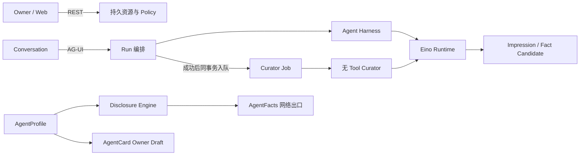

# 架构概览

AegisLink 是 Go 模块化单体与 React Web 客户端组成的 Personal Agent OS。当前部署单元只有一个 API Server、一个 Web Client 和一个 PostgreSQL 数据库；它具备受控的 AgentFacts 网络出口，但不是分布式 Multi-Agent 网络。

```text
React 19 + Vite
  ├── 基于 OpenAPI 生成类型的 REST
  └── 用于活动 Run 的 AG-UI
            │
Gin（internal/httpapi）
            │
领域 Service / Conversation Orchestrator / Agent Harness
            │
  ┌─────────┴──────────┐
PostgreSQL Adapter   领域无关 Runtime
（GORM + Goose）     （Eino + Model Providers）
```

## 四条相互隔离的主链路



- **Owner/控制链**：REST 管理 Account、Agent、Profile、Memory、Skill、MCP、Publication 和历史资源。
- **执行链**：AG-UI 只承载活动 Run；`conversation` 从 PostgreSQL 重新加载权威 Agent 与历史，Harness 再解析上下文和授权能力后调用 Runtime。
- **认知维护链**：只有成功 Run 才产生持久 Curator Job；Worker 异步维护可能有误的 Impression 和待确认 Fact Candidate。
- **对外发布链**：Disclosure Engine 从私有 Profile 构建 AgentFacts；AgentCard 没有真实 A2A interface 时只允许 Owner 预览。

这四条链共享 Agent/Principal 所有权和 PostgreSQL 事务，但不共享传输类型或信任等级。尤其是 AG-UI 输入不能授权 Tool，Curator 输出不能直接成为 Confirmed Fact，Profile 内容也不能绕过 Disclosure Policy 进入网络。

## 后端边界

- `internal/app` 是 composition root，负责装配配置、Repository、Service、Runtime 与 HTTP，不导入 GORM 或模型供应商 SDK 类型。
- `internal/httpapi` 负责 Gin、认证中间件、OpenAPI 形状的 Handler、AG-UI 输入输出和 HTTP 错误映射。
- 业务模块（`account`、`agent`、`conversation`、`memory`、`impression`、`discovery`、`a2a`、`skills`、`mcp`、`catalog`）只使用 `context.Context`、领域类型和小接口。
- `internal/conversation` 负责持久 Run 编排、取消与事件持久化，并调用 `conversation.Harness` 端口。
- `internal/harness` 负责 Agent 上下文、指令、选择策略和授权能力装配，再委托 Runtime。
- `internal/runtime` 只封装领域无关的 Eino Run 与模型供应商 SDK，不导入 AegisLink 领域包。
- `internal/postgres` 封装 GORM、PostgreSQL 专用 SQL、事务、Row Mapping 和连接生命周期；Goose migration 是唯一 Schema 变更机制。

依赖方向固定为 `HTTP -> Service/Orchestrator -> Repository 或 Runtime Port`。Handler 不做业务决策，领域层不实现 SQL Scanner/Valuer，应用层不持有 `*gorm.DB`，前端也不能把生成类型之外的响应形状当作契约。

## 代码目录职责

| 路径                    | 职责                                                                |
| ----------------------- | ------------------------------------------------------------------- |
| `cmd/aegislink-server`  | 进程入口、配置加载和优雅关闭                                        |
| `internal/app`          | Composition Root、Repository/Service 装配、Worker 生命周期          |
| `internal/httpapi`      | Gin、Session、REST、AG-UI、Host-scoped AgentFacts Route             |
| `internal/conversation` | Run 创建、取消、事件持久化、Harness 调用                            |
| `internal/harness`      | Agent 上下文、指令、选择策略与能力装配                              |
| `internal/runtime`      | 领域无关的 Eino Run、Tool 适配与 Model Provider                    |
| `internal/curator`      | 独立无 Tool 的认知模型适配器                                        |
| `internal/impression`   | Impression/Fact Candidate 领域规则与持久 Worker                     |
| `internal/agent`        | Agent、AgentProfile 聚合、版本与 Disclosure Policy                  |
| `internal/discovery`    | AgentFacts 过滤、签名、Token Query、JWKS 与撤销                     |
| `internal/a2a`          | 官方 A2A 类型映射和 AgentCard Readiness，不提供调用端点             |
| `internal/postgres`     | 所有运行时 PostgreSQL 操作、GORM Model/Clause/Transaction           |
| `contracts/http/v1`     | OpenAPI 权威契约；生成 Web TypeScript 类型                          |
| `migrations`            | 只增不改的 Goose Schema 历史                                        |
| `web`                   | React 19/Vite、TanStack Router/Query、assistant-ui 与 AG-UI Adapter |

## 持久化与执行

PostgreSQL 是 Account、Agent、Profile、Impression、Fact Candidate/Confirmed Fact、Curator Job、AgentFacts Publication、Conversation、Message、Run、Run Event、Memory、Skill Package/Binding 和 MCP Library/Binding 的权威数据源。活动 Eino 执行仍在进程内；Server 启动时先应用 Goose migration、将中断 Run 标记为失败，再启动 Curator Worker 恢复可重试任务。

Web 通过 REST 加载持久资源，活动 Run 使用 AG-UI SSE，`/runs/{runId}/events` 继续承担持久化回放与恢复。客户端提交的历史消息、Tool Schema、名称或权限都不能成为服务端权威依据。Owner API 从 Session 得到 Principal；外部 AgentFacts Route 则只按规范化后的真实 HTTP `Host` 选择已验证且启用的发布对象。

## 当前范围

已实现：认证、注册时创建一个默认 Personal Agent、包含模型 Impression 和 Owner-confirmed Fact 的内部 Agent Profile、Runtime 注入、已验证域名下的 AgentFacts 发布、Owner-only AgentCard Draft、Agent 范围 Memory、版本化 Skill Bundle、Principal 所有的 MCP Library 与 Agent Binding、类型化能力选择、只读 Tool 执行及可回放 Conversation。

未实现：公开 AgentCard/A2A endpoint、中央 Index 注册与搜索、第三方 Credential/Attestation、长期 Memory 自动提取与向量检索、写入/破坏性 Tool Approval、MCP OAuth/Secret Storage、委托访问、跨 Agent 路由、Organization、WebSocket、gRPC、Redis 或 Kubernetes 部署。
