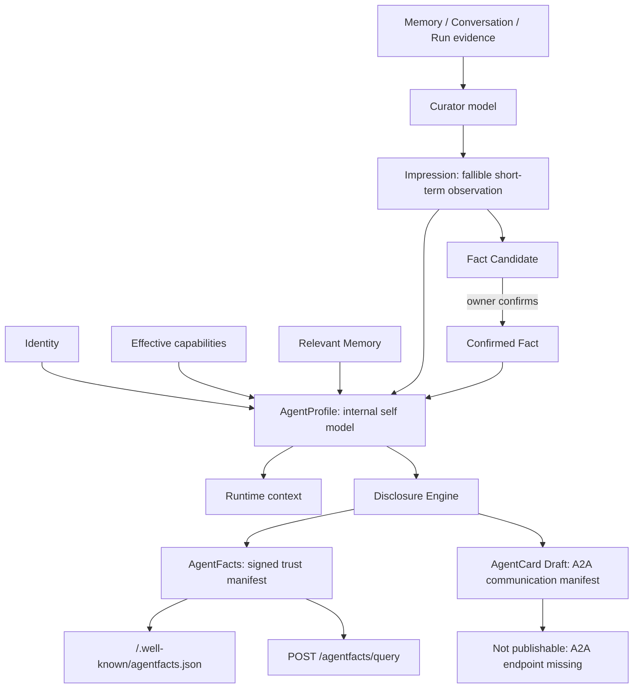

# Cognitive Profile and publication

## Separate internal cognition from external manifests

| Object         | Primary source                                                                       | Trust level                                               | Lifecycle                                                                     | Consumer/network boundary                       |
| -------------- | ------------------------------------------------------------------------------------ | --------------------------------------------------------- | ----------------------------------------------------------------------------- | ----------------------------------------------- |
| Memory         | Explicit owner maintenance                                                           | User-controlled long-term context                         | Active/Forgotten                                                              | Runtime and curator evidence                    |
| Impression     | Curator over recent Context, Runs, Tools, and Memory                                 | Fallible and low priority                                 | Active/Resolved/Stale/Superseded/Dismissed; history is not physically deleted | Runtime and Fact distillation                   |
| Fact Candidate | Curator over one or more Impressions                                                 | Unconfirmed                                               | Pending/Promoted/Rejected                                                     | Owner review inbox                              |
| Confirmed Fact | Owner confirms a Candidate                                                           | Trusted inside the Profile                                | Validity and revocation                                                       | Runtime; Disclosure only when subject=`agent`   |
| AgentProfile   | Server aggregation of Identity, effective Capability, Confirmed Fact, and Impression | Private internal self model                               | `version` + `contextRevision`                                                 | Owner view, Runtime, Disclosure Engine          |
| AgentFacts     | Disclosure-filtered and signed projection                                            | External self-assertion, not fabricated third-party trust | TTL, replacement, and revocation                                              | Well-known, private query, future Index adapter |
| AgentCard      | Profile mapping into official A2A types                                              | Communication Draft                                       | Readiness check                                                               | Owner preview only in this release              |

Memory is durable long-term context and evidence. An Impression is the model's richer, noisier view of what the user is recently doing, learning, using, or deciding. It decays and may be corrected or dismissed. A Fact Candidate must cite an Impression. A Confirmed Fact is durable only after explicit owner confirmation; the curator cannot bypass this boundary.

AgentProfile is the private internal self model assembled for the owner and Runtime. AgentFacts is a separately filtered, signed, expiring, and revocable external trust document. AgentCard is a protocol-specific A2A communication description; without an actual supported interface it remains an owner-only Draft.

## Runtime and curator input boundaries

- `harness.resolveContext` injects active Confirmed Facts and at most 12 active Impressions. Their base score is `confidence × salience × freshness`, with an additional relevance boost when the current message matches terms in an Impression summary.
- Impressions are marked as fallible, low-priority context. They cannot override the System Prompt or authorize Tools, and raw evidence/disclosure metadata is not injected.
- `internal/curator` is an isolated, no-Tool structured model call using a dedicated one-iteration Runtime. Its input is bounded to recent messages, truncated Tool results, relevant Memory, and existing active/recently dismissed Impressions.
- Messages, Memory, and Tool results are untrusted evidence. Only output that passes strict structural and domain validation can create/update/resolve/supersede Impressions or propose Fact Candidates.

## Revisions and background work

- `version` advances for identity, Confirmed Fact, and Disclosure Policy changes.
- `contextRevision` advances for Impression and Fact Candidate changes. Confirming a candidate advances both.
- Every successful Run inserts one unique durable curator job in the same transaction. Failed or cancelled Runs do not enqueue work.
- A PostgreSQL lease with `FOR UPDATE SKIP LOCKED` supports restart recovery, one-Run idempotency, and bounded retry. Curator failure never rolls back an already completed chat.

## Disclosure and publication

Impressions have no external channel. A Confirmed Fact may target AgentFacts/AgentCard only when its subject is `agent`. The public well-known document contains only `public + agent-facts + indexable` claims. POST queries may include non-indexable public claims and, with a valid scoped token, authenticated or exact-audience restricted claims.

A standalone Index implements AgentAddr allocation, complete Fact Vector snapshot replacement, and pgvector exact Search with no public resolve route. The Agent Server derives vectors only from `public + indexable` AgentFacts/Profile units and republishes a complete snapshot after relevant Profile, policy, and Confirmed Fact mutations. Index stores no Facts URL and never fetches AgentFacts. `aegislink.agent-facts/1.0-draft` remains an AegisLink-owned, versioned, Server-authoritative document rather than a claim of an external standard.

Public routes match only a verified, enabled Agent publication by the request's real `Host` and never trust `X-Forwarded-Host`. This release exposes AgentFacts, JWKS, revocations, and POST query routes; it does not register `/.well-known/agent-card.json`.
