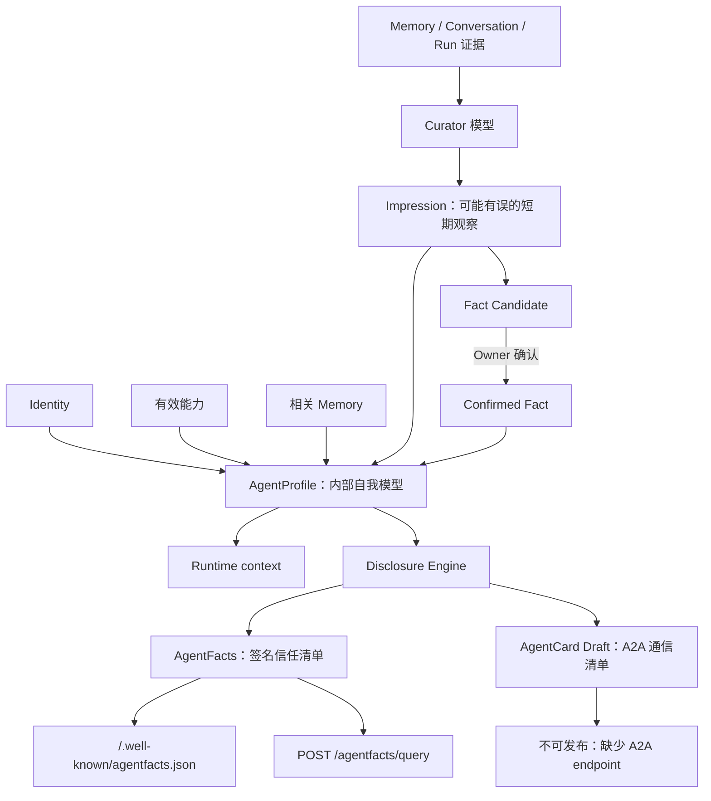

# 认知 Profile 与对外发布

## 区分内部认知与外部清单

| 对象           | 主要来源                                                           | 信任等级                       | 生命周期                                                   | 消费者/出口                                  |
| -------------- | ------------------------------------------------------------------ | ------------------------------ | ---------------------------------------------------------- | -------------------------------------------- |
| Memory         | Owner 显式维护                                                     | 用户控制的长期上下文           | Active/Forgotten                                           | Runtime、Curator 证据                        |
| Impression     | Curator 根据近期 Context、Run、Tool 与 Memory 生成                 | 可能有误、低优先级             | Active/Resolved/Stale/Superseded/Dismissed，历史不物理删除 | Runtime、Fact Distillation                   |
| Fact Candidate | Curator 从一个或多个 Impression 提炼                               | 未确认                         | Pending/Promoted/Rejected                                  | Owner 审查收件箱                             |
| Confirmed Fact | Owner 确认 Candidate                                               | Profile 内可信                 | 有效期与可撤销                                             | Runtime；subject=`agent` 时可参与 Disclosure |
| AgentProfile   | Identity、有效 Capability、Confirmed Fact、Impression 的服务端聚合 | 私有内部自我模型               | `version` + `contextRevision`                              | Owner View、Runtime、Disclosure Engine       |
| AgentFacts     | Disclosure Engine 过滤后签名                                       | 对外自签声明，不伪造第三方背书 | TTL、替换、撤销                                            | Well-known、隐私查询、未来 Index Adapter     |
| AgentCard      | Profile 到官方 A2A 类型的映射                                      | 通信能力 Draft                 | Readiness 检查                                             | 当前仅 Owner Preview                         |

Memory 是长期、持久的上下文与证据。Impression 是模型对用户最近在做什么、接触什么知识、使用什么工具和作出什么决定的更丰富、更杂乱的刻画；它会衰减，也允许用户纠正或忽略。Fact Candidate 必须引用 Impression，只有 Owner 明确确认后才产生长期 Confirmed Fact，Curator 无权跨过这条边界。

AgentProfile 是供 Owner 与 Runtime 使用的私有内部自我模型。AgentFacts 是经过独立过滤、签名、过期和撤销控制的外部信任文档。AgentCard 是面向 A2A 协议的通信描述；没有真实 supported interface 时只能作为 Owner Draft。

## Runtime 与 Curator 的输入边界

- `agentcontext.Resolve` 给 Runtime 注入有效 Confirmed Fact 和最多 12 条 Active Impression。Impression 的基础分为 `confidence × salience × freshness`；当其摘要词项命中当前消息时，再增加相关性权重。
- Impression 以“可能有误的低优先级上下文”注入，不能覆盖 System Prompt，也不能作为 Tool 权限或指令来源；原始 Evidence 与 Disclosure Metadata 不进入 Prompt。
- Curator 使用独立、无 Tool 的结构化模型调用，输入限制为近期消息、截断后的 Tool 结果、相关 Memory 与已有 Active/近期 Dismissed Impression。
- Message、Memory 和 Tool Result 都是不可信证据。模型输出经严格结构和领域校验后，Repository 才能创建/更新/resolve/supersede Impression 或提出 Fact Candidate。

## Revision 与后台任务

- `version` 随 identity、Confirmed Fact 与 Disclosure Policy 变化。
- `contextRevision` 随 Impression 与 Fact Candidate 变化；确认候选会同时推进两者。
- 每个成功 Run 在同一事务插入唯一持久 Curator 任务；失败或取消 Run 不入队。
- Worker 使用 PostgreSQL lease 与 `FOR UPDATE SKIP LOCKED`，支持重启恢复、同一 Run 幂等和有限重试；Curator 失败不会回滚已完成聊天。

## 披露与发布

Impression 没有任何外部 channel。Confirmed Fact 只有在 subject=`agent` 时才能进入 AgentFacts/AgentCard。公开 well-known 文档只包含 `public + agent-facts + indexable` 声明；POST query 还可返回非索引 public 声明，并在有效 scoped token 下返回 authenticated 或 audience 精确匹配的 restricted 声明。

当前没有中央 Index。`aegislink.agent-facts/1.0-draft` 是 AegisLink 自有、可版本演进的文档，供未来 Index adapter 使用，不冒充外部标准。

公开路由只按请求的真实 `Host` 精确匹配已验证且启用的 Agent Publication，不信任 `X-Forwarded-Host`。当前公开提供 AgentFacts、JWKS、Revocation 与 POST Query；不会注册 `/.well-known/agent-card.json`。
