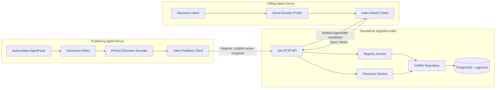
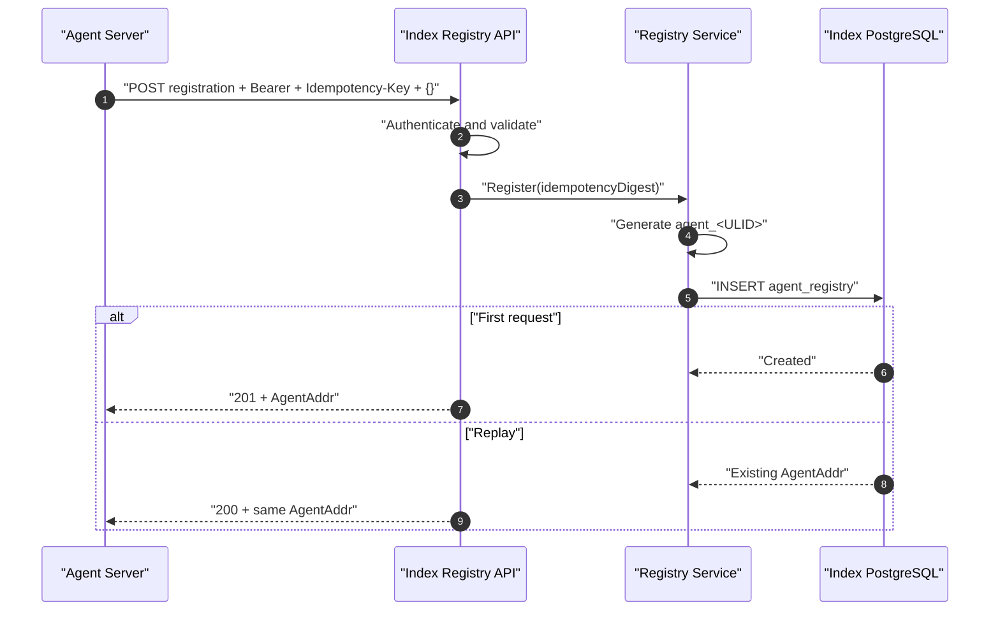
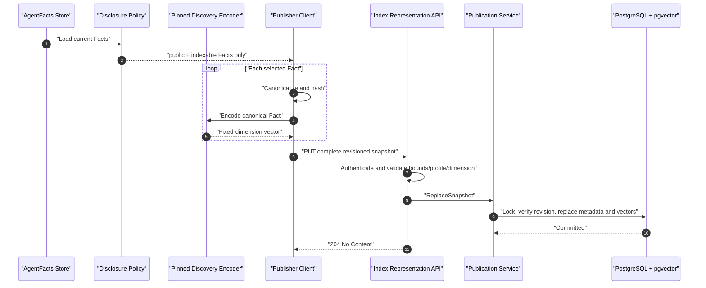
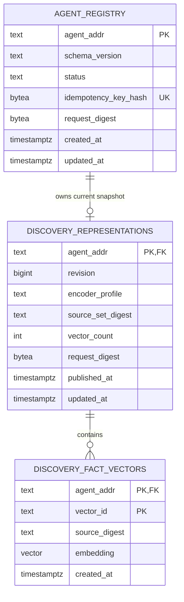

# AegisLink PostgreSQL + pgvector Three-Stage Discovery Design

## 1. Status and decision

This document replaces the previous retrieval design with exactly three business stages:

1. **Register**: an Agent Server asks Index to allocate a stable `AgentAddr`.
2. **Publish / Update**: the Agent Server selects public, indexable AgentFacts, encodes each Fact with the network-wide Encoder Profile, and uploads a complete vector snapshot.
3. **Search**: a caller encodes its Discovery Query with the same Encoder Profile; Index searches PostgreSQL + pgvector and returns ranked AgentAddr candidates.

The target design removes the empty registration `lsh` field, Facts URLs, Index-side AgentFacts fetching, LSH/HashIndex, structured facet retrieval, and post-search AgentFacts fetching. Index stores no raw AgentFacts, only vector snapshots and version metadata.

The standalone Index implements all three stages: empty-object registration and idempotent replay, atomic Representation replacement in pgvector, and exact cosine Search grouped by AgentAddr. The Agent Server now completes first-run registration, disclosure-gated Profile encoding, automatic complete-snapshot publication after Profile, policy, and Confirmed Fact mutations, explicit sync retry, and query encoding through its authenticated Discovery endpoint. The legacy public resolve route remains removed.

## 2. Core model

`AgentAddr` is an opaque, stable address allocated by Index, using the existing `agent_<ULID>` form. It contains no name, endpoint, Facts URL, embedding, TTL, or LSH payload. A Search result is an ordered list of AgentAddr values; subsequent Agent-to-Agent communication is outside this slice.

AgentFacts remain authoritative on the Agent Server. Only Facts accepted by `public + indexable` disclosure are normalized and encoded. Index receives one vector record per selected Fact:

- stable `vectorId` within the current snapshot;
- SHA-256 `sourceDigest` of the canonical Fact input;
- fixed-dimension `embedding`;

One Fact per vector preserves independent semantics and lets a query match any published Fact. Each Agent is capped at 64 vectors so Agents with many Facts cannot consume unbounded storage or recall slots. An empty snapshot is valid: it removes old vectors and makes the Agent undiscoverable.

Every publisher and caller uses one versioned Encoder Profile, for example:

```text
aegislink-discovery-v1:text-embedding-model:1536:cosine
```

The profile fixes canonicalization, model/version, dimension, distance, normalization, and truncation. Index does not run an encoder or require model credentials. It validates profile, dimension, bounded counts, and finite values. Vectors from different profiles are never compared; the MVP activates one profile.

## 3. System boundary



Index never connects to an Agent Server database and never fetches AgentFacts. Agent Server owns Fact selection and encoding. Index PostgreSQL is authoritative only for addresses, current representation revisions, and vectors. Results express semantic proximity, not identity, truth, or reachability.

## 4. Stage 1: Register and receive AgentAddr

```http
POST /api/v1/registry/agents
Authorization: Bearer <INDEX_REGISTRATION_TOKEN>
Idempotency-Key: <1-128 characters>
Content-Type: application/json

{}
```

The request carries no AgentFacts, name, URL, TTL, LSH, or vector. A first request returns `201 Created`:

```json
{
  "schemaVersion": "aegislink.agent-addr/0.2-draft",
  "agentAddr": "agent_01JQ7Y8M4P2N6R0V9K3X5T1CWA",
  "createdAt": "2026-08-27T10:00:00Z"
}
```

A replay with the same token, idempotency key, and empty request returns the same address with `200 OK` and `Idempotency-Replayed: true`.



The Registry target contains only `agent_addr`, schema/status, token-scoped idempotency digest, request digest, and timestamps. The controlled-network MVP reuses `INDEX_REGISTRATION_TOKEN` for publication, so registration still returns only AgentAddr. A production credential should be scoped to its AgentAddr, but that authentication enhancement does not add a Discovery business stage.

## 5. Stage 2: Publish or update a vector snapshot

The Agent Server republishes after a public/indexable Fact is added, changed, revoked, expires, has its disclosure changed, or is re-encoded under a new profile. Every request is a complete replacement, never a partial patch, so removed Fact vectors cannot remain searchable.

A Fact is deterministically canonicalized before encoding, for example:

```text
kind=<kind>\nnamespace=<namespace>\nkey=<key>\nvalue=<canonical-json>
```

Object keys are sorted, Unicode is NFC-normalized, and irrelevant IDs/timestamps are omitted. Conversation, Memory, prompts, credentials, restricted disclosure, and private Skill content never become encoding inputs.

Target request:

```http
PUT /api/v1/registry/agents/{agentAddr}/representation
Authorization: Bearer <INDEX_REGISTRATION_TOKEN>
Content-Type: application/json
```

```json
{
  "schemaVersion": "aegislink.discovery-representation/0.2-draft",
  "revision": 7,
  "encoderProfile": "aegislink-discovery-v1:text-embedding-model:1536:cosine",
  "sourceSetDigest": "sha256:9de3...",
  "vectors": [
    {
      "vectorId": "fact_7b2c...",
      "sourceDigest": "sha256:148a...",
      "embedding": [0.012, -0.031, 0.008]
    }
  ]
}
```

Example vectors are abbreviated. The MVP accepts 0–64 vectors, rejects non-finite values and mismatched dimensions, and requires a monotonically increasing revision. An empty snapshot clears the previous vectors. `sourceSetDigest` is `sha256:` plus SHA-256 over vectors sorted by `vectorId`, with each `vectorId` and `sourceDigest` encoded as a four-byte big-endian byte length followed by its UTF-8 bytes. A request digest makes an identical same-revision retry idempotent; conflicting or older revisions return `409 stale_representation_revision`. The first JSON implementation uses a 2 MiB request limit; a measured production protocol may use binary float32, Base64, or Protobuf.



Replacement is one PostgreSQL transaction: lock current representation, compare revision, upsert metadata, delete old rows, insert the new vector set, and commit. Concurrent updates can never let an older revision overwrite a newer one.

## 6. Stage 3: Search and return AgentAddr

The caller builds a bounded Discovery Query Text locally and encodes it with the same profile. Only its vector is sent to Index; the raw conversation and query text stay on the caller.

```http
POST /api/v1/discovery/search
Authorization: Bearer <INDEX_QUERY_TOKEN>
Content-Type: application/json
```

```json
{
  "schemaVersion": "aegislink.discovery-query/0.2-draft",
  "encoderProfile": "aegislink-discovery-v1:text-embedding-model:1536:cosine",
  "embedding": [0.018, -0.027, 0.009],
  "topK": 5
}
```

```json
{
  "schemaVersion": "aegislink.discovery-result/0.2-draft",
  "encoderProfile": "aegislink-discovery-v1:text-embedding-model:1536:cosine",
  "candidates": [
    {
      "agentAddr": "agent_01JQ7Y8M4P2N6R0V9K3X5T1CWA",
      "score": 0.8732,
      "matchedVectorId": "fact_7b2c...",
      "representationRevision": 7
    }
  ]
}
```

`topK` defaults to 5 and is capped at 50. Results sort by score descending, representation revision descending, then AgentAddr ascending.

```mermaid
sequenceDiagram
    autonumber
    participant Run as "Calling Run"
    participant Caller as "Caller Agent Server"
    participant Encoder as "Same Discovery Encoder"
    participant API as "Index Search API"
    participant Search as "Search Service"
    participant PGV as "PostgreSQL + pgvector"

    Run->>Caller: "Discover an Agent"
    Caller->>Caller: "Build bounded Query Text"
    Caller->>Encoder: "Encode with active profile"
    Encoder-->>Caller: "Query Vector"
    Caller->>API: "POST Search with vector + Top-K"
    API->>API: "Authenticate and validate"
    API->>Search: "Search(QueryVector, Top-K)"
    Search->>PGV: "Nearest Fact Vectors"
    PGV-->>Search: "Cosine candidates"
    Search->>Search: "Group by AgentAddr; select best Fact match"
    Search->>Search: "Stable sort and limit"
    Search-->>API: "Ranked AgentAddr candidates"
    API-->>Caller: "200 DiscoveryResult"
    Caller-->>Run: "Use selected AgentAddr"
```

The flow ends when AgentAddr candidates are returned. There is no fourth Facts URL fetch or verification stage.

## 7. PostgreSQL + pgvector storage



With one fixed profile, the initial migration uses `VECTOR(1536)` without an ANN index:

```sql
CREATE EXTENSION IF NOT EXISTS vector;

CREATE TABLE discovery_representations (
    agent_addr TEXT PRIMARY KEY REFERENCES agent_registry(agent_addr) ON DELETE CASCADE,
    revision BIGINT NOT NULL CHECK (revision > 0),
    encoder_profile TEXT NOT NULL,
    source_set_digest TEXT NOT NULL,
    vector_count INTEGER NOT NULL CHECK (vector_count BETWEEN 0 AND 64),
    request_digest BYTEA NOT NULL CHECK (octet_length(request_digest) = 32),
    published_at TIMESTAMPTZ NOT NULL,
    updated_at TIMESTAMPTZ NOT NULL
);

CREATE TABLE discovery_fact_vectors (
    agent_addr TEXT NOT NULL REFERENCES discovery_representations(agent_addr) ON DELETE CASCADE,
    vector_id TEXT NOT NULL,
    source_digest TEXT NOT NULL,
    embedding VECTOR(1536) NOT NULL,
    created_at TIMESTAMPTZ NOT NULL,
    PRIMARY KEY (agent_addr, vector_id)
);

```

Exact cosine is the correctness baseline. HNSW must be added only in a later Goose migration after recall and latency measurements justify it.

Runtime access remains GORM-only and schema changes remain Goose-only. Existing `agent_addresses` deployments require a new migration to copy only Agent address/idempotency/timestamp data into `agent_registry`; legacy `facts_url`, `lsh_json`, name, and cache TTL do not migrate.

## 8. Query execution

The small-network MVP uses exact cosine and picks each Agent's best matching Fact Vector:

```text
agentScore = max(cosine(queryVector, factVector_i))
```

```sql
WITH vector_scores AS (
    SELECT
        v.agent_addr,
        v.vector_id,
        r.revision,
        1 - (v.embedding <=> CAST($1 AS vector)) AS score,
        ROW_NUMBER() OVER (
            PARTITION BY v.agent_addr
            ORDER BY (v.embedding <=> CAST($1 AS vector)) ASC, v.vector_id ASC
        ) AS per_agent_rank
    FROM discovery_fact_vectors v
    JOIN discovery_representations r USING (agent_addr)
    JOIN agent_registry a USING (agent_addr)
    WHERE a.status = 'active' AND r.encoder_profile = $2
)
SELECT agent_addr, vector_id, revision, score
FROM vector_scores
WHERE per_agent_rank = 1
ORDER BY score DESC, revision DESC, agent_addr ASC
LIMIT $3;
```

At larger scale, HNSW first retrieves `topK * overfetchFactor` vector rows, then Index deduplicates by AgentAddr and applies the same score/tie rules. With status/profile filtering, a read transaction can set `SET LOCAL hnsw.iterative_scan = strict_order` so pgvector continues scanning when filters remove candidates. HNSW adoption is measured against exact Recall@5/10, MRR, p50/p95 latency, storage per Agent, publication latency, and deletion correctness.

There is no LSH fallback. If PostgreSQL reaches its capacity limit, retain the same Register/Publish/Search domain protocol and evaluate partitioning, replicas, or a dedicated Vector Database adapter.

Exact search, HNSW, cosine operators, and iterative scans follow the [official pgvector documentation](https://github.com/pgvector/pgvector).

## 9. Internal structure and implementation slices

Target dependency direction:

```text
index/internal/httpapi
  -> registry.Service / discovery.Service
  -> Registry / RepresentationStore / VectorSearch ports
  -> index/internal/postgres GORM adapters
  -> PostgreSQL + pgvector
```

Retire `StructuredIndex`, `HashIndex`, `RoutingKey`, `WeightedRoutingKey`, `HashSignature`, and the multi-signal `Ranker`. The first ranking rule belongs to VectorSearch: per-Agent max similarity plus deterministic ties.

Implementation slices:

1. **Register — implemented**: OpenAPI removes name, Facts URL, TTL, and LSH; empty registration allocates AgentAddr; a new Goose migration evolves Registry; public resolve is absent.
2. **Publish / Update — implemented end to end**: Index provides pgvector tables, shared-token authentication, validation, idempotent monotonic revisions, and atomic snapshot replacement. Agent Server provides the pinned OpenAI-compatible encoder, disclosure filtering, deterministic Profile units and digests, automatic publication after setup/Profile/policy/Confirmed Fact changes, and explicit retry sync.
3. **Search — implemented end to end**: Index provides exact cosine, per-Agent aggregation, stable ranking, and the query-token boundary. Agent Server validates owner-scoped Discovery input, encodes it with the same Encoder Profile, and returns the ranked Index candidates; HNSW waits for measurements.

## 10. Final invariants

1. Registration allocates only AgentAddr and carries no discovery content.
2. Raw AgentFacts remain only on Agent Server; no URL-based Index fetch exists.
3. Publishers and callers use the same Encoder Profile.
4. Index stores only the current complete vector snapshot and version metadata.
5. Updates atomically replace the snapshot so removed Fact vectors cannot remain.
6. Search uses the Vector Database and directly returns AgentAddr candidates.
7. Exact cosine is the baseline; pgvector HNSW is the measured scale path.
8. The design contains no LSH, Hash Index, routing facets, or NANDA data model.
9. Index remains independent from Agent Server databases, model credentials, and runtime.
10. Discovery ends at Register, Publish/Update, and Search.
