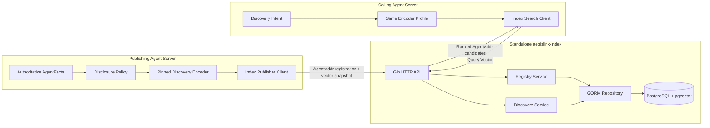
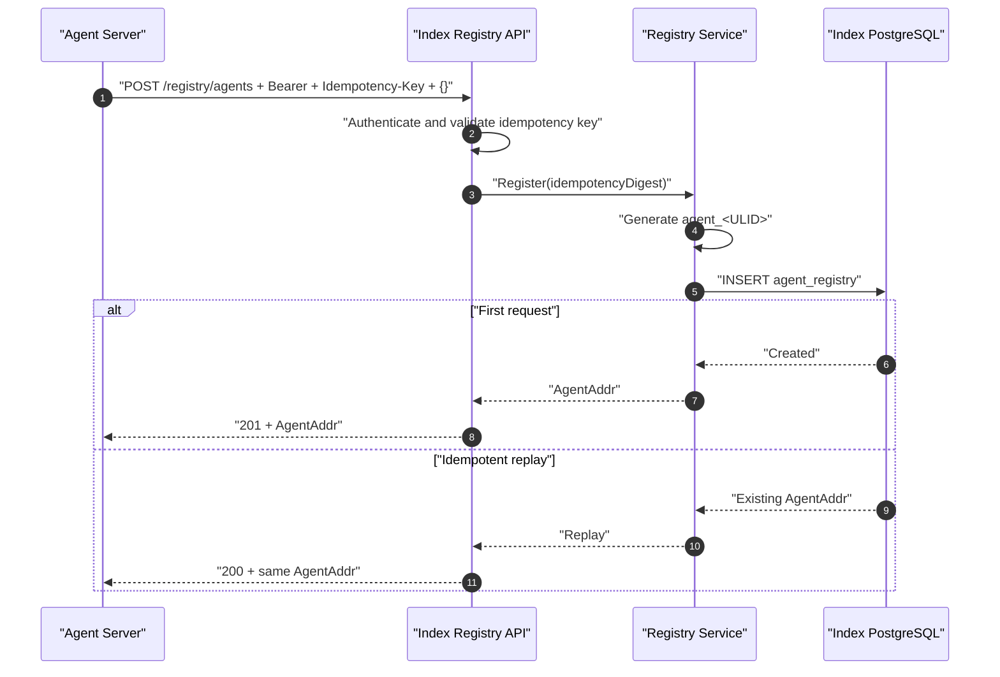
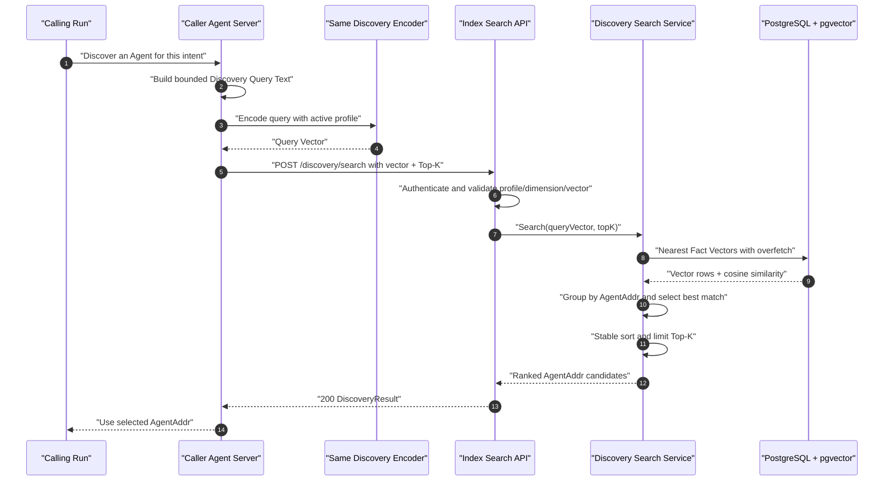
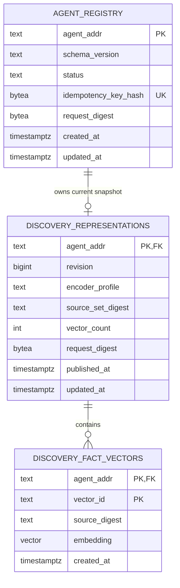

# AegisLink PostgreSQL + pgvector 三阶段 Discovery 技术设计

## 1. 文档状态

本文重新定义 AegisLink Index 的目标实现，只保留三个业务阶段：

1. **Register**：Agent Server 向 Index 注册，Index 分配并返回唯一 `AgentAddr`。
2. **Publish / Update**：Agent Server 从自己的 AgentFacts 中选择允许公开发现的 Facts，使用全网一致的 Encoder 编码成向量快照，再上传给 Index 保存或替换。
3. **Search**：调用方 Agent Server 使用同一 Encoder 把 Discovery Query 编码成 Query Vector，Index 通过 PostgreSQL + pgvector 检索并直接返回 AgentAddr 候选。

本设计明确取消以下旧方向：

- 注册请求不再包含空 `lsh` 字段；
- AgentAddr 不再包含 `factsUrl`，Index 也不通过 URL 拉取 AgentFacts；
- 不实现 LSH、Hash Signature、Hash Index 或 LSH/PQ 演进路线；
- MVP 不做结构化 Facet 倒排检索，也不在 Search 后增加 AgentFacts 回源验证阶段；
- Index 不保存 AgentFacts 原文，只保存由 Agent Server 上传的向量和必要版本元数据。

当前独立 Index 已完成全部三阶段：空对象注册与幂等重放、pgvector Representation 原子替换，以及按 AgentAddr 聚合的 exact cosine Search。Agent Server 已完成首次设置注册、Disclosure Policy 过滤后的 Profile 编码、Profile/Policy/Confirmed Fact 变化后的完整快照自动发布、显式同步重试，以及通过受认证 Discovery 接口进行 Query 编码与 Index 查询。旧 public Resolve 路由保持移除。

## 2. 核心模型

### 2.1 AgentAddr

`AgentAddr` 是 Index 分配的、不透明、稳定的 Agent 逻辑地址。MVP 使用现有 ULID 形式：

```text
agent_01JQ7Y8M4P2N6R0V9K3X5T1CWA
```

它不包含名称、Facts URL、Embedding、Endpoint 或 LSH 数据。Discovery Search 的最终产物就是一个按相似度排序的 AgentAddr 列表。AgentAddr 后续如何用于 Agent 间通信不属于本切片。

在 Go 领域模型中建议直接使用强类型，避免同时存在语义重复的 `AgentID` 和 `AgentAddr`：

```go
type AgentAddr string
```

### 2.2 AgentFacts 与 Fact Vector

AgentFacts 继续由 Agent Server 权威保存。只有满足 `public + indexable` Disclosure Policy 的 Facts 才能进入 Discovery 编码输入。

Index 不接收这些 Facts 的 JSON 原文。Agent Server 将选中的 Facts 规范化为若干独立文本单元，用统一 Encoder 分别编码，上传以下数据：

- `vectorId`：本次向量快照内稳定的逻辑 ID；
- `sourceDigest`：规范化 Fact 输入的 SHA-256，用于更新审计，不可反推出原文；
- `embedding`：固定维度的浮点向量；

一条 Fact 对应一个向量，而不是把所有 Facts 强制压成一个向量。这样新增或删除某条能力不会改变其他 Fact 的语义，并且 Query 可以命中 Agent 的任意一个公开 Fact。MVP 对每个 Agent 限制最多 64 个向量，避免拥有大量 Facts 的 Agent 在候选召回中获得不公平优势。允许上传空快照；它表示该 Agent 当前没有可发现 Facts，Index 必须删除旧向量并使其退出 Search。

### 2.3 Encoder Profile

所有 Publisher 和 Query Caller 必须使用同一个版本化 Encoder Profile：

```text
aegislink-discovery-v1:text-embedding-model:1536:cosine
```

Encoder Profile 至少固定：

- 文本规范化规则；
- Embedding 模型及版本；
- 向量维度；
- 距离函数，MVP 固定为 cosine；
- 是否执行 L2 normalization；
- 最大输入长度和截断策略。

Index 不运行 Encoder，也不需要模型密钥。它只验证 `encoderProfile`、维度、有限浮点数和向量数量，然后执行 pgvector 查询。不同 Encoder Profile 的向量不能直接比较；MVP 只激活一个 Profile。

## 3. 系统边界



边界不变量：

- Agent Server 数据库保存 AgentFacts 原文；Index 永远不连接该数据库。
- Agent Server 负责 Fact 选择、规范化和编码；Index 不理解 Fact 内容。
- Index PostgreSQL 是 AgentAddr、当前 Representation Revision 和 Fact Vectors 的权威存储。
- Search 返回向量相似候选，不声明身份、事实真实性或服务可达性。
- 不存在 Facts URL 或注册后的 AgentFacts Fetch 链路。

## 4. 阶段一：注册并获得 AgentAddr

### 4.1 目标接口

```http
POST /api/v1/registry/agents
Authorization: Bearer <INDEX_REGISTRATION_TOKEN>
Idempotency-Key: <1-128 characters>
Content-Type: application/json

{}
```

注册请求不携带 AgentFacts、名称、URL、TTL、LSH 或向量。Index 只验证认证和幂等键，然后分配地址。

首次注册返回 `201 Created`：

```json
{
  "schemaVersion": "aegislink.agent-addr/0.2-draft",
  "agentAddr": "agent_01JQ7Y8M4P2N6R0V9K3X5T1CWA",
  "createdAt": "2026-08-27T10:00:00Z"
}
```

相同 Token、幂等键和空请求重放返回同一 AgentAddr、`200 OK` 和 `Idempotency-Replayed: true`。同一幂等键如果未来携带不同版本参数，则返回 `409 idempotency_conflict`。

### 4.2 注册时序



### 4.3 注册存储

注册表只承担地址分配和更新所有权基础：

```sql
CREATE TABLE agent_registry (
    agent_addr TEXT PRIMARY KEY,
    schema_version TEXT NOT NULL,
    status TEXT NOT NULL DEFAULT 'active',
    idempotency_key_hash BYTEA NOT NULL UNIQUE,
    request_digest BYTEA NOT NULL,
    created_at TIMESTAMPTZ NOT NULL,
    updated_at TIMESTAMPTZ NOT NULL,
    CONSTRAINT agent_registry_addr_format
        CHECK (agent_addr ~ '^agent_[0-9A-HJKMNP-TV-Z]{26}$'),
    CONSTRAINT agent_registry_status
        CHECK (status IN ('active', 'disabled'))
);
```

`idempotency_key_hash` 继续使用 `SHA-256(token + NUL + key)`，不保存原始 Token。小规模 MVP 的发布更新暂时复用共享 `INDEX_REGISTRATION_TOKEN`，因此注册仍然只返回 AgentAddr。生产化时应改为每个 AgentAddr 独立的 Publisher Credential，但这属于认证增强，不增加新的 Discovery 业务阶段。

## 5. 阶段二：发布或更新向量快照

### 5.1 何时上传

Agent Server 在以下事件后重新构建并上传完整向量快照：

- 首次获得 AgentAddr 且已有公开可索引 Facts；
- 公开可索引 Fact 被新增、修改、撤销或过期；
- Disclosure Policy 改变某个 Fact 的 `public/indexable` 状态；
- Encoder Profile 升级并完成重新编码；
- 管理员显式要求重新发布。

更新不是逐条 Patch。每次请求都代表该 AgentAddr 在指定 Revision 下的**完整当前快照**。Index 在一个事务中替换旧向量，避免已撤销 Fact 的旧向量残留。

### 5.2 Agent Server 的编码输入

Publisher 从 AgentFacts 中只选择允许公开发现的 Facts。每条 Fact 先生成确定性文本：

```text
kind=<kind>\nnamespace=<namespace>\nkey=<key>\nvalue=<canonical-json>
```

规范化要求：

- JSON object key 按字典序排列；
- Unicode 使用 NFC；
- 不加入数据库 ID、更新时间等无关噪声；
- 不加入 Conversation、Memory、System Prompt、Credential、私有 Skill 内容；
- 相同 Fact 与相同 Encoder Profile 必须生成相同输入和向量。

建议 `vectorId` 使用 `SHA-256(canonical fact identity)` 的短编码，而 `sourceDigest` 对完整规范化输入求 SHA-256。Index 用这些值识别快照内容，但不获取原文。

### 5.3 目标接口

```http
PUT /api/v1/registry/agents/{agentAddr}/representation
Authorization: Bearer <INDEX_REGISTRATION_TOKEN>
Content-Type: application/json
```

```json
{
  "schemaVersion": "aegislink.discovery-representation/0.2-draft",
  "revision": 7,
  "encoderProfile": "aegislink-discovery-v1:text-embedding-model:1536:cosine",
  "sourceSetDigest": "sha256:9de3...",
  "vectors": [
    {
      "vectorId": "fact_7b2c...",
      "sourceDigest": "sha256:148a...",
      "embedding": [0.012, -0.031, 0.008]
    },
    {
      "vectorId": "fact_16a9...",
      "sourceDigest": "sha256:632f...",
      "embedding": [-0.021, 0.044, 0.017]
    }
  ]
}
```

示例向量已截断；真实 `embedding` 长度必须等于 Profile 固定维度。MVP 限制：

- 每个 Agent 允许 0–64 个 Fact Vectors；空快照会清除旧向量并让 Agent 退出 Search；
- 首个 HTTP JSON 实现将请求体上限设为 2 MiB；生产接口可根据测量结果改用 float32 binary、Base64 或 Protobuf；
- 所有数值必须为有限 float32；
- `revision` 必须严格大于已存 Revision；
- `sourceSetDigest` 为 `sha256:` 加 SHA-256 Hex：先按 `vectorId` 排序，再把每个 `vectorId` 与 `sourceDigest` 分别编码为 4-byte Big-endian 字节长度和 UTF-8 字节后依次 Hash，用于幂等审计。

成功返回 `204 No Content`。相同 Revision 和完全相同的请求摘要可幂等返回 `204`；相同或更低 Revision 且内容不同返回 `409 stale_representation_revision`。

### 5.4 发布时序

```mermaid
sequenceDiagram
    autonumber
    participant Facts as "Agent Server AgentFacts Store"
    participant Policy as "Disclosure Policy"
    participant Encoder as "Pinned Discovery Encoder"
    participant Publisher as "Index Publisher Client"
    participant API as "Index Representation API"
    participant Service as "Discovery Publication Service"
    participant PG as "PostgreSQL + pgvector"

    Facts->>Policy: "Load current AgentFacts"
    Policy-->>Publisher: "Only public + indexable Facts"
    loop "Each selected Fact"
        Publisher->>Publisher: "Canonicalize and hash source"
        Publisher->>Encoder: "Encode canonical Fact"
        Encoder-->>Publisher: "Fixed-dimension vector"
    end
    Publisher->>Publisher: "Build complete revisioned snapshot"
    Publisher->>API: "PUT Representation"
    API->>API: "Authenticate, bound body, validate profile/dimensions"
    API->>Service: "ReplaceSnapshot(agentAddr, revision, vectors)"
    Service->>PG: "BEGIN; lock current representation"
    PG->>PG: "Check monotonic revision"
    PG->>PG: "Upsert representation metadata"
    PG->>PG: "Delete previous vectors and insert new vectors"
    PG->>PG: "COMMIT"
    PG-->>Service: "Committed revision"
    Service-->>API: "Updated"
    API-->>Publisher: "204 No Content"
```

## 6. 阶段三：提交 Query Vector 并返回 AgentAddr

### 6.1 Caller 构建查询

Caller Agent Server 从当前 Run 中提取一个用于发现的短 Query Text，例如：

```text
需要能够审计 Go 服务并分析恶意软件的 Agent
```

Caller 使用与 Publisher 完全相同的 Encoder Profile 编码。默认只把 Query Vector 发送给 Index，原始 Conversation 和 Query Text 不离开 Caller Server。

### 6.2 目标接口

```http
POST /api/v1/discovery/search
Authorization: Bearer <INDEX_QUERY_TOKEN>
Content-Type: application/json
```

```json
{
  "schemaVersion": "aegislink.discovery-query/0.2-draft",
  "encoderProfile": "aegislink-discovery-v1:text-embedding-model:1536:cosine",
  "embedding": [0.018, -0.027, 0.009],
  "topK": 5
}
```

响应：

```json
{
  "schemaVersion": "aegislink.discovery-result/0.2-draft",
  "encoderProfile": "aegislink-discovery-v1:text-embedding-model:1536:cosine",
  "candidates": [
    {
      "agentAddr": "agent_01JQ7Y8M4P2N6R0V9K3X5T1CWA",
      "score": 0.8732,
      "matchedVectorId": "fact_7b2c...",
      "representationRevision": 7
    }
  ]
}
```

Index 不返回 Fact 原文，因为它没有保存原文。`matchedVectorId` 只用于 Agent Server 自己关联发布记录和调试，不应被解释为公开 Fact。

`topK` 默认 5，最大 50。稳定排序规则为：

1. `score DESC`；
2. `representation_revision DESC`；
3. `agent_addr ASC`。

### 6.3 完整查询时序



这条链路到 AgentAddr 返回即结束，没有 Facts URL Fetch 或 AgentFacts 回源验证的第四阶段。

## 7. PostgreSQL + pgvector 存储模型

### 7.1 ER 图



### 7.2 Migration 雏形

固定单一 Encoder Profile 时，初版使用固定维度列且不创建 ANN 索引：

```sql
CREATE EXTENSION IF NOT EXISTS vector;

CREATE TABLE discovery_representations (
    agent_addr TEXT PRIMARY KEY
        REFERENCES agent_registry(agent_addr) ON DELETE CASCADE,
    revision BIGINT NOT NULL,
    encoder_profile TEXT NOT NULL,
    source_set_digest TEXT NOT NULL,
    vector_count INTEGER NOT NULL,
    request_digest BYTEA NOT NULL,
    published_at TIMESTAMPTZ NOT NULL,
    updated_at TIMESTAMPTZ NOT NULL,
    CONSTRAINT discovery_revision_positive CHECK (revision > 0),
    CONSTRAINT discovery_vector_count CHECK (vector_count BETWEEN 0 AND 64),
    CONSTRAINT discovery_request_digest_length CHECK (octet_length(request_digest) = 32)
);

CREATE TABLE discovery_fact_vectors (
    agent_addr TEXT NOT NULL
        REFERENCES discovery_representations(agent_addr) ON DELETE CASCADE,
    vector_id TEXT NOT NULL,
    source_digest TEXT NOT NULL,
    embedding VECTOR(1536) NOT NULL,
    created_at TIMESTAMPTZ NOT NULL,
    PRIMARY KEY (agent_addr, vector_id)
);

```

Exact cosine 是正确性基线；只有 Recall 与延迟评测证明收益后，才通过后续 Goose Migration 增加 HNSW。

运行时 PostgreSQL 操作继续使用 GORM；Migration 继续由 Goose 管理，不使用 `AutoMigrate`。

### 7.3 旧表迁移策略

现有 `agent_addresses` 已经可能被应用，因此不能修改旧 Migration。实现时新增 Migration：

1. 新建目标 `agent_registry`；
2. 只迁移旧记录的 `agent_id`、幂等摘要、请求摘要和时间戳；
3. 不迁移 `facts_url`、`lsh_json`、`agent_name` 或 `ttl_seconds`；
4. 新建 Representation 和 Vector 表；
5. 应用层切换到新 Repository 后，再在单独的兼容性窗口决定是否删除旧表。

如果当前数据库仅用于尚未发布的开发环境，也仍应通过新 Goose Migration 完成迁移，以保持迁移历史可验证。

## 8. pgvector 查询实现

### 8.1 小规模 MVP：Exact cosine baseline

小规模 Agent 网络首先使用 exact cosine，对全部活跃向量计算相似度并按 Agent 聚合：

```sql
WITH vector_scores AS (
    SELECT
        v.agent_addr,
        v.vector_id,
        r.revision,
        1 - (v.embedding <=> CAST($1 AS vector)) AS score,
        ROW_NUMBER() OVER (
            PARTITION BY v.agent_addr
            ORDER BY
                (v.embedding <=> CAST($1 AS vector)) ASC,
                v.vector_id ASC
        ) AS per_agent_rank
    FROM discovery_fact_vectors v
    JOIN discovery_representations r USING (agent_addr)
    JOIN agent_registry a USING (agent_addr)
    WHERE a.status = 'active'
      AND r.encoder_profile = $2
)
SELECT agent_addr, vector_id, revision, score
FROM vector_scores
WHERE per_agent_rank = 1
ORDER BY score DESC, revision DESC, agent_addr ASC
LIMIT $3;
```

Agent 级得分采用该 Agent 最相似 Fact Vector 的 cosine similarity：

```text
agentScore = max(cosine(queryVector, factVector_i))
```

MVP 不混入 freshness、结构化 facet 或 LSH 碰撞分数。这样可以直接建立可解释的 exact baseline。

### 8.2 扩展阶段：HNSW 候选 + Agent 聚合

向量量增大后，先用 HNSW 取 Fact Vector 候选，再按 AgentAddr 去重。带状态/Profile 过滤时可在只读事务中设置 `SET LOCAL hnsw.iterative_scan = strict_order`，让 pgvector 在过滤导致候选不足时继续扫描：

```sql
WITH nearest_vectors AS MATERIALIZED (
    SELECT
        v.agent_addr,
        v.vector_id,
        r.revision,
        1 - (v.embedding <=> CAST($1 AS vector)) AS score
    FROM discovery_fact_vectors v
    JOIN discovery_representations r USING (agent_addr)
    JOIN agent_registry a USING (agent_addr)
    WHERE a.status = 'active'
      AND r.encoder_profile = $2
    ORDER BY v.embedding <=> CAST($1 AS vector)
    LIMIT $3
), ranked_agents AS (
    SELECT DISTINCT ON (agent_addr)
        agent_addr, vector_id, revision, score
    FROM nearest_vectors
    ORDER BY agent_addr, score DESC, vector_id ASC
)
SELECT agent_addr, vector_id, revision, score
FROM ranked_agents
ORDER BY score DESC, revision DESC, agent_addr ASC
LIMIT $4;
```

其中 `$3 = topK * overfetchFactor`，初始可取 `20`，并设置最大上限。HNSW 只改变候选生成，不改变最终 Agent 聚合和稳定排序。

切换 HNSW 前必须以 exact baseline 评估：

- Recall@5 / Recall@10；
- MRR；
- p50 / p95 Search Latency；
- 每个 Agent 的平均向量数和存储字节；
- Publish Replacement Latency；
- 删除 Fact 后旧向量是否完全消失。

本项目不再设计 LSH fallback。若 pgvector 达到单机容量上限，优先评估 PostgreSQL 分区、只读副本或专用 Vector Database Adapter，但领域协议仍保持 Register、Publish、Search 三阶段不变。

Exact Search、HNSW、cosine operator 与 iterative scan 的行为以 [pgvector 官方文档](https://github.com/pgvector/pgvector)为准。

## 9. Index 内部代码结构

目标调用方向：

```text
index/internal/httpapi
  -> index/internal/registry.Service
  -> index/internal/discovery.Service
  -> index/internal/discovery.Repository ports
  -> index/internal/postgres GORM adapters
  -> PostgreSQL + pgvector
```

建议收敛后的 Ports：

```go
type Registry interface {
    Register(context.Context, RegisterCommand) (AgentAddr, bool, error)
    Exists(context.Context, AgentAddr) (bool, error)
}

type RepresentationStore interface {
    Replace(context.Context, RepresentationSnapshot) error
}

type VectorSearch interface {
    Search(context.Context, QueryVector, int) ([]Candidate, error)
}
```

删除或停止扩展以下旧抽象：

- `StructuredIndex`；
- `HashIndex`；
- `RoutingKey`、`WeightedRoutingKey`；
- `HashSignature`；
- 多信号 `Ranker`。

MVP 的 Ranking 是 VectorSearch Adapter 内明确的 Agent 聚合与稳定排序规则，不需要先建立通用 Ranker 框架。

## 10. 校验、错误和并发语义

### Register

| 条件                 | HTTP / Error Code                    |
| -------------------- | ------------------------------------ |
| Token 缺失或错误     | `401 unauthorized`                   |
| Idempotency-Key 非法 | `400 invalid_idempotency_key`        |
| 幂等重放             | `200` + `Idempotency-Replayed: true` |
| 幂等内容冲突         | `409 idempotency_conflict`           |

### Publish / Update

| 条件                                              | HTTP / Error Code                   |
| ------------------------------------------------- | ----------------------------------- |
| AgentAddr 不存在                                  | `404 agent_not_found`               |
| Encoder Profile 不支持                            | `422 encoder_profile_unsupported`   |
| 维度错误、NaN、Inf、单条 Embedding 为空或超过上限 | `422 invalid_vector_snapshot`       |
| Revision 过旧或相同 Revision 内容不同             | `409 stale_representation_revision` |
| 成功完整替换                                      | `204`                               |

### Search

| 条件                        | HTTP / Error Code                 |
| --------------------------- | --------------------------------- |
| Query Token 无效            | `401 unauthorized`                |
| Encoder Profile 不支持      | `422 encoder_profile_unsupported` |
| Query Vector 维度或数值非法 | `422 invalid_query_vector`        |
| 无候选                      | `200` + `{"candidates":[]}`       |
| 数据库不可用                | `503 index_unavailable`           |

Publish 使用 AgentAddr 行锁和单事务 replacement。并发 Revision `7`、`8` 到达时，无论请求完成顺序如何，最终只能保留 Revision `8`；旧 Revision 不得覆盖新 Revision。

## 11. 安全与隐私边界

- Index API 不记录 Bearer Token、完整向量或请求体。
- Index 虽不保存 Fact 原文，但 Embedding 仍可能泄露语义，因此只能编码允许公开发现的 Facts。
- Agent Server 必须在编码前执行 Disclosure Policy，而不是依赖 Index 过滤。
- Search Query Vector 也可能泄露意图，应使用 TLS、Query Token、Rate Limit 和最短必要日志。
- Index 无法仅凭向量证明 Fact 真实性；它只提供相似度导航。
- AgentAddr 被禁用后立即从 Search 结果排除，但物理删除和审计保留策略另行定义。

## 12. 三个实现切片

### Slice 1：纯 AgentAddr 注册

- **已实现**：OpenAPI 已删除 `agentName`、`factsUrl`、`ttlSeconds` 和 `lsh`；
- **已实现**：注册请求为空 object，只返回 AgentAddr 与创建时间；
- **已实现**：`agent_registry` 保存 AgentAddr、状态、幂等摘要和时间戳；
- **已实现**：通过新增 Goose Migration 演进旧 Registry；
- **已实现**：不提供独立 public resolve，未来 Search 将直接返回 AgentAddr。

### Slice 2：Representation 发布与更新

- **Index 已实现**：pgvector Extension、Representation/Fact Vector Migration、共享 Token 认证、快照校验、幂等单调 Revision 与事务 replacement；
- **Index 已验证**：新增、修改、删除、空快照与并发 Revision；
- **Agent Server 已实现**：固定 OpenAI-compatible Encoder 配置、Disclosure 过滤、确定性 Profile 单元与摘要、setup/Profile/Policy/Confirmed Fact 变化后的完整快照自动发布，以及显式重试同步。

### Slice 3：Vector Search

- **Index 已实现**：exact cosine、AgentAddr 聚合、稳定排序，并返回 AgentAddr、Score、Matched Vector ID 和 Representation Revision；
- **Agent Server 已实现**：Owner-scoped Discovery HTTP 输入校验、使用相同 Encoder Profile 生成 Query Vector，并通过认证 Index Search 返回排序候选；
- 建立 exact baseline 后才按规模评估 HNSW；
- 不增加 LSH、Facts URL Fetch 或结构化倒排旁路。

## 13. 最终不变量

1. 注册只分配 AgentAddr，不上传任何发现内容。
2. AgentFacts 原文只存在于 Agent Server，不存在 URL-based Index Fetch。
3. Publisher 与 Caller 必须使用同一 Encoder Profile。
4. Index 只保存当前完整向量快照及其版本元数据。
5. Update 是原子完整替换，旧 Fact Vector 不得残留。
6. Search 只依赖 Vector Database，结果直接是 AgentAddr 候选。
7. MVP 使用 exact cosine；规模需要时使用 pgvector HNSW。
8. 不再引入 LSH、Hash Index、Routing Facet 或 NANDA 数据模型。
9. Index 与 Agent Server 数据库、模型密钥和运行时保持独立。
10. 整个 Discovery 功能严格止于 Register、Publish/Update、Search 三阶段。
